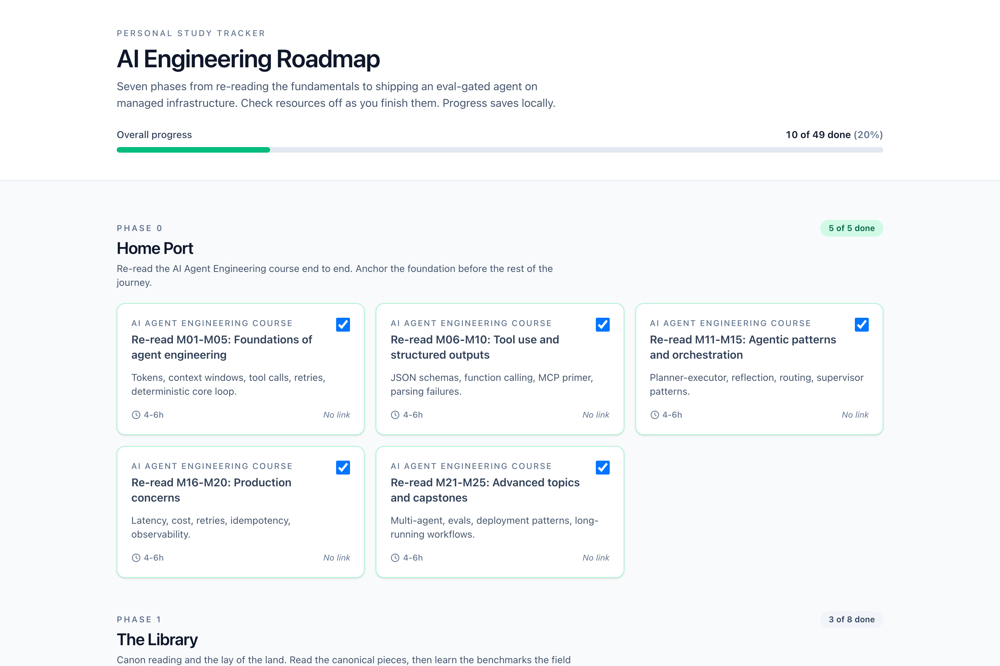
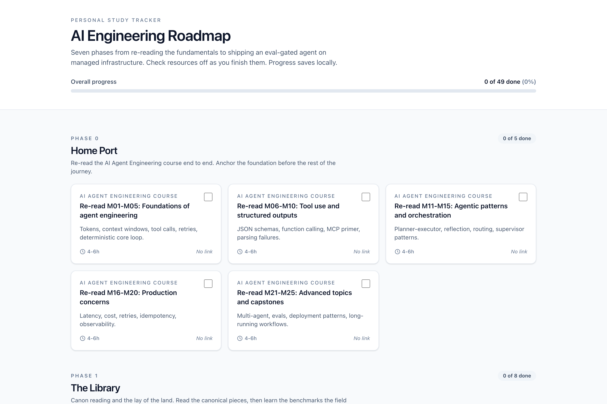
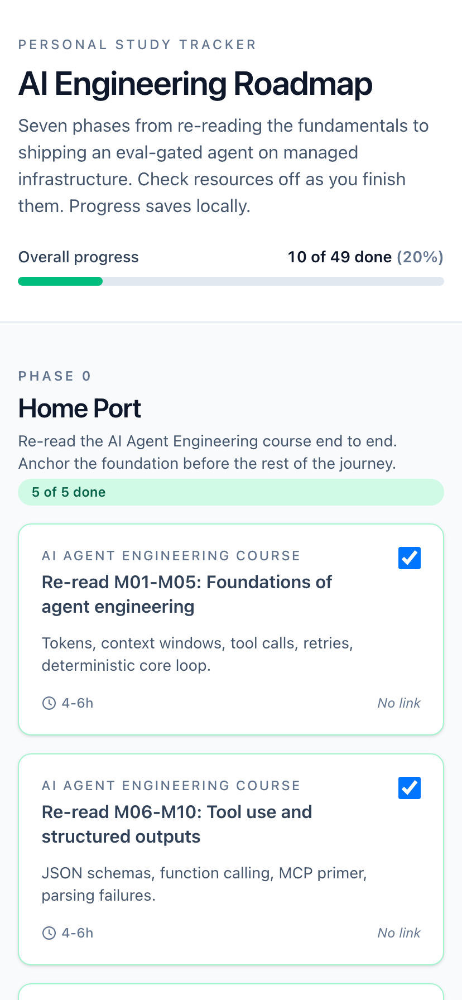

# AI Engineering Roadmap

A personal study tracker for AI agent engineering, organized as seven phases
from re-reading the fundamentals to shipping an eval-gated agent on managed
infrastructure. Click the checkbox on a resource to mark it complete. Progress
saves to localStorage.



This is a personal artifact, not a distributed course. The roadmap content is
curated free and cheap resources for getting from "I can build an agent" to
"I can ship a production agent on managed infrastructure with evals gating
deploys."

## Live

[https://mihailo2501.github.io/ai-engineering-roadmap/](https://mihailo2501.github.io/ai-engineering-roadmap/)

## What this is

A single-page cards UI. A header shows the title and a progress bar with the
overall count of resources completed. Below it, seven sections render in
order, each with the phase number, region name, blurb, and a per-phase count
of how many resources are done. Each resource is a card with title, source,
time estimate, an external link button, and a checkbox. The grid is one
column on mobile, two on tablet, three on desktop.

No backend. Progress is keyed in localStorage as `aer:progress:v1`. Clear the
key in DevTools to reset the tracker.

## Screenshots

| Fresh start | Mid progress | Mobile |
|---|---|---|
|  |  |  |

## The seven phases

| Phase | Region | Theme |
|---|---|---|
| 0 | Home Port | Re-read the AI Agent Engineering course end to end |
| 1 | The Library | Canon reading and agent benchmarks |
| 2 | Harbor of Protocols | MCP, Anthropic primitives, the programmatic surface |
| 3 | The Workshop | Open source models, fine-tuning, memory beyond RAG |
| 4 | Framework Crossroads | Multi-framework fluency and multi-agent coordination |
| 5 | The Observatory | Evals discipline |
| 6 | The Summit | Cloud capstone and cost engineering |

## Tech stack

- Vite + React 19 + TypeScript
- Tailwind 4 for styling, Inter via system stack
- GitHub Pages for hosting via the included Actions workflow
- Playwright for screenshot generation

## Local dev

```sh
npm install
npm run dev
```

The dev server runs on `http://localhost:5173`. Production build:

```sh
npm run build
npm run preview
```

## Screenshots and verification

```sh
npm run preview &
npm run screenshots
```

Verify the deployed URL renders without console errors:

```sh
npm run verify
```

## License

[MIT](./LICENSE).
