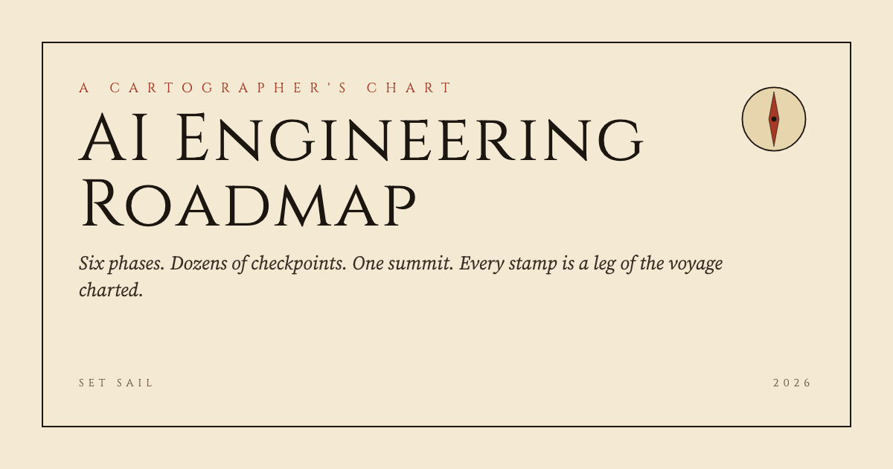
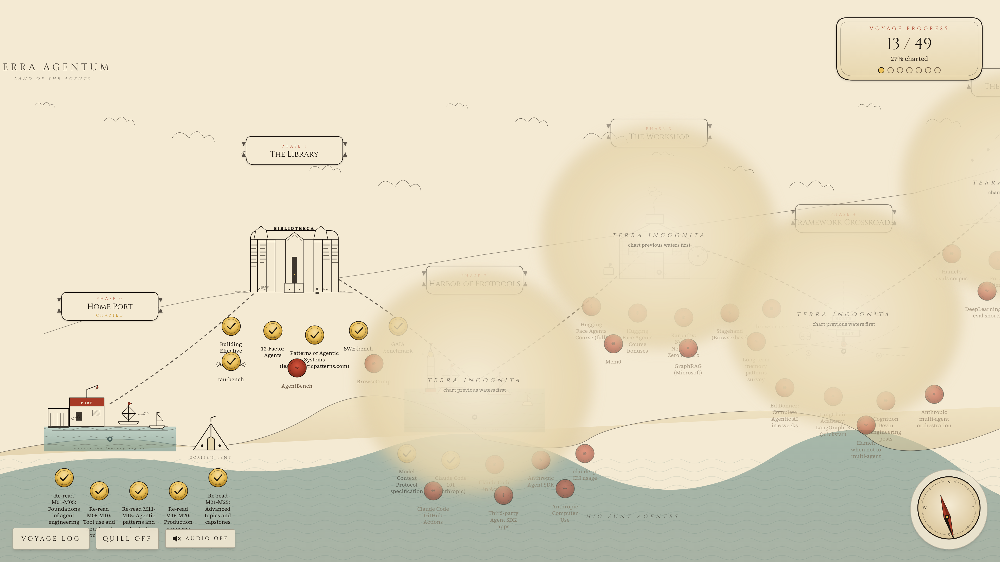
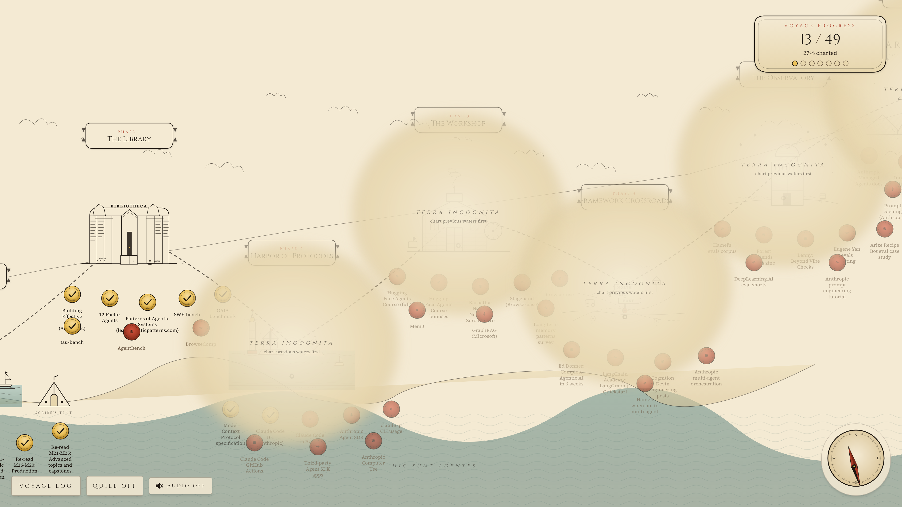
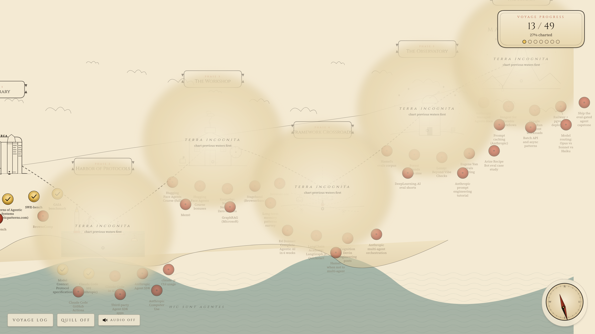

# AI Engineering Roadmap

An interactive, illustrated cartographer's map of my journey through AI agent
engineering. Six phases, dozens of checkpoints, one summit. Click a checkpoint
to stamp it complete. Progress persists in localStorage. Cinematic Remotion
sequences play at phase completion and at the capstone.



This is a personal artifact, not a distributed course. The roadmap content is
curated free and cheap resources for getting from "I can build an agent" to
"I can ship a production agent on managed infrastructure with evals gating
deploys."

## Live

> The deploy URL lands here after the first GitHub Pages build completes.

## What this is

A horizontally-scrollable parchment map, drawn in an old-world ink-line style.
Each phase is a region. Each resource is a wax-seal checkpoint. Clicking a
seal stamps it gold. Completing a phase lifts the fog from the next region. A
voyage log slides out on the side with timestamped entries and a place to
scribble reflections. The compass needle pivots toward your most recent
stamp. Audio toggles off by default and the entire surface respects
`prefers-reduced-motion`.

There are three Remotion-rendered cinematics: an intro reel that plays on
first visit, a phase-completion ceremony that plays each time you finish a
region, and a capstone reveal that plays when all six phases are charted.

## Screenshots

| Early voyage | Mid-voyage | Approaching the summit |
|---|---|---|
|  |  |  |

## The six phases (plus Home Port)

| Phase | Region | Theme |
|---|---|---|
| 0 | Home Port | Re-read the AI Agent Engineering course end to end |
| 1 | The Library | Canon reading and agent benchmarks |
| 2 | Harbor of Protocols | MCP, Anthropic primitives, the programmatic surface |
| 3 | The Workshop | Open source models, fine-tuning, memory beyond RAG |
| 4 | Framework Crossroads | Multi-framework fluency and multi-agent coordination |
| 5 | The Observatory | Evals discipline |
| 6 | The Summit | Cloud capstone and cost engineering |

## Features

- Interactive cartographer's map with horizontal scroll, fog of war on locked
  phases, compass that points at the latest stamp, and ambient flourishes
  (smoke from the workshop, drifting fog, sea-monster blink at the edge).
- Click-to-check checkpoint seals with stamp drop, ink splatter, and a
  visible journey path that turns gold once a phase is complete.
- Voyage log drawer with timestamped entries and free-text reflections,
  persisted in localStorage.
- Scribe's Tent modal explaining where the actual note-taking happens (a
  separate study scratchpad project).
- Three Remotion cinematics committed to `public/cinematics/`: intro reel,
  per-phase completion ceremony, capstone reveal. Each gated by localStorage
  so they play once.
- Audio toggle (off by default) with synthesized ambient drone and SFX
  for stamps, page turns, wax seal, quill scratch, and modals.
- Stretch features: quill cursor with fading ink trail, hidden secret
  checkpoint reachable by exploration, hi-res PDF export of the map state,
  one-click LinkedIn share image generator, Konami-code fast-travel mode that
  lists numbered keyboard shortcuts to each region.

## Tech stack

- Vite + React 19 + TypeScript
- MDX for content authoring
- Tailwind 4 for styling
- Framer Motion for interactions and ambient animations
- Remotion for pre-rendered cinematic sequences
- jsPDF and html-to-image, lazy-loaded for export features
- GitHub Pages for hosting
- Playwright for screenshot generation

## Local dev

```sh
npm install
npm run dev
```

The dev server runs on `http://localhost:5173`. Production build:

```sh
npm run build
npm run preview
```

## Regenerating assets

Audio (under 500 KB total) is synthesized with ffmpeg:

```sh
node scripts/generate-sounds.mjs
```

Cinematics (about 6.5 MB total) render via Remotion:

```sh
npm run render:all
```

Screenshots and OG card use a Playwright capture script against the preview
server:

```sh
npm run preview &
node scripts/capture-screenshots.mjs
```

## Credits

- Audio: synthesized via ffmpeg lavfi filters, original to the project. See
  `public/sounds/credits.md` for the exact synthesis recipe per track. Swap
  any track in `public/sounds/` for a curated Pixabay, Mixkit, or Freesound
  source under the same filename without code changes.
- Illustrations: hand-crafted SVG, kept in a consistent ink-line style.
- Cinematics: three Remotion compositions committed to `public/cinematics/`.
- Fonts: Cinzel (display) and Source Serif 4 (body) from Google Fonts.

## License

[MIT](./LICENSE).
